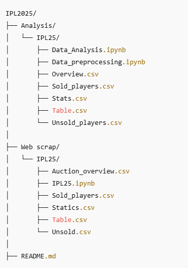

# 🏏 IPL 2025 Data Analysis with Python

This project provides a complete analysis of the Indian Premier League (IPL) 2025 season using Python and its powerful data analysis libraries. It includes visualizations, player and team statistics, financial insights, and performance metrics.

## 📌 Project Objectives

- Analyze team and player performance in IPL 2025
- Compare scores, boundaries, and win metrics
- Understand team auction data
- Visualize financial aspects like team expenses and remaining funds
- Highlight top performers 

## 🧰 Tools & Libraries Used

- `pandas` – for data cleaning and manipulation  
- `matplotlib` & `seaborn` – for creating plots and charts  
- `numpy` – for numerical operations  
- `Jupyter Notebook` – for interactive coding and analysis
- `Beautifulsoup`- for scrap HTML of ipl websites
- `selenium`- for find and get web objects 

## 📁 Project Structure

## 🔍 Key Insights

- **Top Teams**: Teams with highest scores and net run rates
- **Best Batsman**: Based on total runs, boundaries, and average
- **Team Expenses**: Which team spent the most on players
- **Uncapped vs Capped**: Sold squads based on Capped/Uncapped

## 📊 Visualizations Included

- Bar charts: Total runs scored vs conceded  
- Line plots: Net Run Rate trends   
- Grouped bar charts: Overseas and total players  
 
### Project Contribution by Aayush Rabari 

